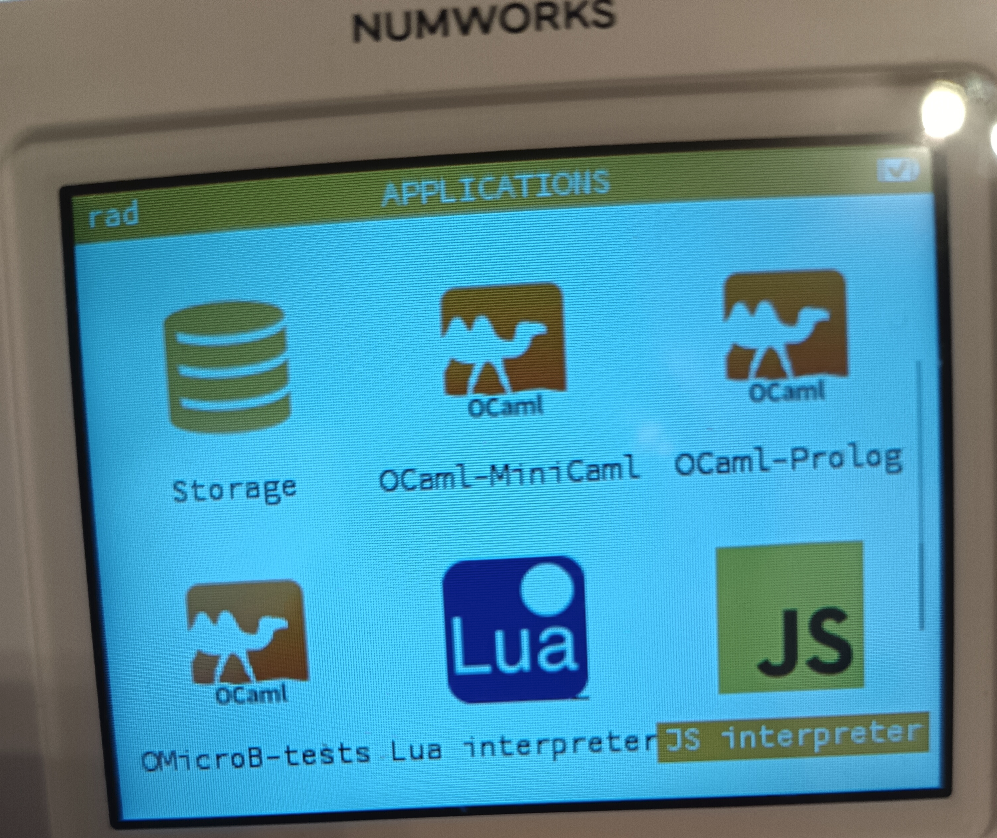

# JavaScript interpreter for the NumWorks calculator

[](https://github.com/Naereen/A-JavaScript-interpreter-for-the-NumWorks-calculator/actions/workflows/build.yml)

This apps lets you run a [JavaScript](https://en.wikipedia.org/wiki/JavaScript) script on your [NumWorks calculator](https://www.numworks.com)!
[](https://en.wikipedia.org/wiki/JavaScript)

----

## Install the app

[](screenshot-documentations/screenshot-documentation-icon-of-application.png)

Installing is rather easy:

1. (not yet, see 2) Download the latest `javascript.nwa` file from the [Releases](https://github.com/Naereen/A-JavaScript-interpreter-for-the-NumWorks-calculator/releases) page ;
2. This Release page is not-yet ready, on this project, use [this folder instead](https://perso.crans.org/besson/publis/Numworks-apps/), and [this direct link](https://perso.crans.org/besson/publis/Numworks-apps/javascript.nwa) ;
3. Head to [my.numworks.com/apps](https://my.numworks.com/apps) to send the `nwa` file on your calculator (on Google Chrome browser). On [this page](https://my.numworks.com/python/lilian-besson-1/javascript) you will be able to also send a default example of a JavaScript file (a tiny test script), and you can edit it yourself later on, on your calculator!

----

## How to use the app

Just launch the app, and it will read and execute your script `javascript.py`!

This script should be located in the `javascript.py` file, that you can create, edit and save **from within your NumWorks!**.

If you want a demo, use [this `javascript.py` script](https://my.numworks.com/python/lilian-besson-1/javascript), that you can install on your NumWorks calculator, directly from their website (from my user space).

[](screenshot-documentations/video-documentation-icon-of-application.gif)

----

## Dependencies

This programs uses [the code generated by the Espruino project](https://github.com/espruino/Espruino/blob/master/README_Building.md#embedding-in-other-applications) (`espruino_embedded.c`, `espruino_embedded.h` etc), a portable JavaScript interpreter for microcontrolers.

### My fork of Espruino

I've started to work on [my fork of Espruino](https://github.com/Naereen/Espruino), in order to solve [this issue](https://github.com/Naereen/A-JavaScript-interpreter-for-the-NumWorks-calculator/issues/2): I wanted to give access to NumWorks's EADK library (see [`eadk.h`](https://github.com/numworks/epsilon/blob/master/eadk/include/eadk/eadk.h)) to the JavaScript files that are executed in this Espruino JS interpreter.
*It's a work in progress!*

To rebuild the two `espruino_embedded.c` and `espruino_embedded.h` files from Espruino's source code, you must run this in its main directory (of my fork, not the main project):

```bash
BOARD=EMBED RELEASE=1 V=1 make
```

Then remove these lines from the `espruino_embedded.c` file:

```c
typedef unsigned char __u_char;
typedef unsigned short int __u_short;
...
typedef __intmax_t intmax_t;
typedef __uintmax_t uintmax_t;
```

Copy the files you obtained to the `./src/javascript/` folder on this project (they are included, you shouldn't have to do this, unless you want to help me developping this!).

----

## Documentation of the `Eadk` module accessible in JavaScript on the NumWorks

Here is a short documentation for each function that I've ported from their interface in [`eadk.h`](https://github.com/numworks/epsilon/blob/master/eadk/include/eadk/eadk.h) to a working version in JavaScript.

I've exposed an `Eadk` module (see example in JavaScript below, or [here](https://github.com/Naereen/A-JavaScript-interpreter-for-the-NumWorks-calculator/issues/3#issuecomment-2910813161)), which comes ready with these functions and constants:

> *Legend:*
> - ✅ = code written, function tested!
> - ✅? = code written, function not yet working!
> - ❌ = code written, function unavailable / or code not yet written!!

### ✅? Eadk predefined colors
`Eadk.color_black`, `Eadk.color_white`, `Eadk.color_red`, `Eadk.color_green`, `Eadk.color_blue` are the five predefined colors.

### ✅ Screen width and height
`Eadk.SCREEN_WIDTH` and `Eadk.SCREEN_HEIGHT` are the screen's width and height, respectively.

### ✅ Controlling the screen's brightness
#### ✅ `int Eadk.backlight_brightness()`

Returns the screen's brightness, it's a 8 bits integer (`uint8_t` in C), ranging between 0 (min brightness, screen almost shut down) to 240 (for max brightness).

#### ✅ `void Eadk.backlight_set_brightness(int brightness)`

Sets the screen's brightness to this value.
`brightness` **must** be an integer value which fits inside a `uint8_t`, between 0 and 256.

### ✅ Accessing the Battery levels

#### ✅ `bool Eadk.battery_is_charging()`

Indicates whether the battery is charging.

#### ✅ `uint8_t Eadk.battery_level()`

Returns a 8 bits integer giving the battery level.

#### ✅ `float Eadk.battery_voltage()`

Returns a floating value of the battery voltage (in Volt, I guess?).

> These functions are missing from the hardware!
> See [this issue on NumWorks/epsilon's repository](https://github.com/numworks/epsilon/issues/2326)
> DONE: [I just implemented them myself, by SVC calls](https://github.com/Naereen/A-JavaScript-interpreter-for-the-NumWorks-calculator/issues/5)

### ✅ Display

#### ❌✅ `void Eadk.display_draw_string(const char* text, uint16_t x, uint16_t y, bool large_font, uint16_t text_color, uint16_t background_color)`

Displays a given `text` string, at a `{x,y}` position, in large/small font (`large_font`?), with the text in `text_color` and the background in `background_color`.

For instance:
```javascript
Eadk.display_draw_string(text, x, y, large, text_color, background_color);
```

> TODO: it's still a bit buggy!

### ✅ Timing

#### ✅ `void Eadk.timing_usleep(uint32_t us)`

Sleep for `us` micro-seconds

#### ✅ `void Eadk.timing_msleep(uint32_t ms)`

Sleep for `ms` micro-seconds

#### ✅ `uint64_t Eadk.timing_millis()`

Time since boot of the machine? Not clear. FIXME:

### ✅ Miscellanious

#### ✅ `bool Eadk.usb_is_plugged()`

Indicates whether the USB is plugged.

> This function is missing from the hardware!
> See [this issue on NumWorks/epsilon's repository](https://github.com/numworks/epsilon/issues/2326)
> DONE: [I just implemented it myself, by SVC calls](https://github.com/Naereen/A-JavaScript-interpreter-for-the-NumWorks-calculator/issues/5)

#### ✅ `uint32_t Eadk.random()`

Returns an almost truly random number, generated from the hardware RNG (a uint32_t, unsigned 32 bits integer).


### How to add new functions to Espruino JavaScript's `Eadk` module?

To add new functions, edit in [my fork of Espruino](https://github.com/Naereen/Espruino/) the files: [`libs/eadk/jswrap_eadk.c`](https://github.com/Naereen/Espruino/blob/master/libs/eadk/jswrap_eadk.c) and [`libs/eadk/jswrap_eadk.h`](https://github.com/Naereen/Espruino/blob/master/libs/eadk/jswrap_eadk.h).
The functions already present should give a good direction to follow!

----

## Example of a tiny JavaScript test file

The example below runs now correctly and showcases a decreasing then increasing brightness, with small pauses between every change:

For a more complete and length example, see [`src/test.js`](src/test.js).

```javascript
// Save this to `javascript.py` on your NumWorks, and run it with
// the "JS interpreter" NumWorks application!

console.log("Hello world from JavaScript!");
console.log("Testing Eadk functions:");
Eadk.timing_msleep(5000);

const brightness = Eadk.backlight_brightness();
console.log("Eadk.backlight_brightness() =", Eadk.backlight_brightness());
Eadk.timing_msleep(2000);

for (let dwarf = 1; dwarf <= 13; dwarf++) {
    for (let b = brightness; b >= 0; b=b-16) {
        Eadk.set_backlight_brightness(b);
        console.log("Eadk.backlight_brightness() =", Eadk.backlight_brightness());
        Eadk.timing_msleep(50);
    }

    for (let b = 0; b <= brightness; b=b+16) {
        Eadk.set_backlight_brightness(b);
        console.log("Eadk.backlight_brightness() =", Eadk.backlight_brightness());
        Eadk.timing_msleep(50);
    }
}
```

----

## Build the app

To build this sample app, you will need to install the [embedded ARM toolchain](https://developer.arm.com/Tools%20and%20Software/GNU%20Toolchain) and [nwlink](https://www.npmjs.com/package/nwlink).

```shell
brew install numworks/tap/arm-none-eabi-gcc node # Or equivalent on your OS
npm install -g nwlink
make clean && make build
```

----

## :scroll: License ? [](https://github.com/Naereen/A-JavaScript-interpreter-for-the-NumWorks-calculator/blob/master/LICENSE)

[MIT Licensed](https://lbesson.mit-license.org/) (file [LICENSE](LICENSE)).
© [Lilian Besson](https://GitHub.com/Naereen), 2025.

[](https://GitHub.com/Naereen/A-JavaScript-interpreter-for-the-NumWorks-calculator/graphs/commit-activity)
[](https://GitHub.com/Naereen/ama)

[](https://GitHub.com/Naereen/)
[](http://ForTheBadge.com)
[](https://GitHub.com/)
[](http://ForTheBadge.com)

